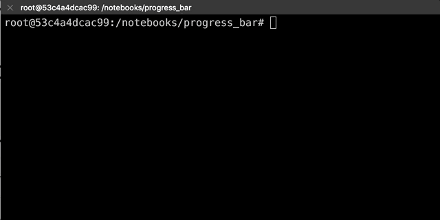

# progress_bar  [](https://travis-ci.org/shijungg/progress_bar)

## Overview

A progress bar tool, there are two versions(grey version and color version).




## Dependencies

* Python 2.7 or 3

## How to use?

Import the ProgressBar class to your code from progress_bar_color.py or progress_bar.py

```python
from progress_bar_color import ProgressBar
```

Creat a ProgressBar class and pass your total steps(i.e. 1000) to initialize it

```python
pb = ProgressBar(1000)
```

Every time you finish one step, call show_progress funtion to update the progress bar

```python
...
pb.show_progress()
```

When you finish your job, don't remember to call end function to start a new line

```python
pb.end()
```

You can see *test_progress_bar.py* for reference.

## You want to change the color?

If you want to change the color to show, just modify a number in *test_progress_bar.py*

You can find this:

```python
'\033[0;34m %d \033[0m'
```

The '0' before ';' is to define whether show high light color or not. '1' is to show high light color, '0' is not.

The '34' before ';' is the character color, you can change it to the following value:

| color     | value |
| --------- | ----- |
| black     | 30    |
| red       | 31    |
| green     | 32    |
| yellow    | 33    |
| blue      | 34    |
| deep pink | 35    |
| cyan      | 36    |
| white     | 37    |


## FAQ

You may get this error when you use python3:

```
UnicodeEncodeError: 'ascii' codec can't encode characters in position 27-66: ordinal not in range(128)
```

**Solution:**

Add following argument to file ~/.bashrc

```shell
export LANG='C.UTF-8'
```

Then execute:

```shell
source ~/.bashrc
```

